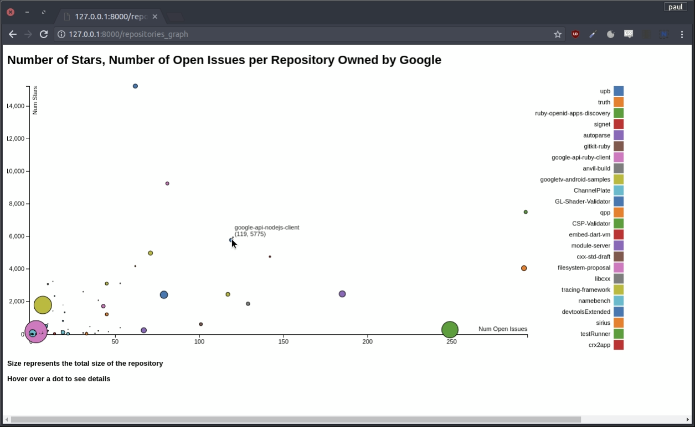

# Github Visualisation Web-app #
A Django webserver visualising github data.
### Visualizing number of open issues and number of stars for all of the public repositories by google ###
  

### Number of Commits per Contributor on a Repository. ###
  

  Data is gathered from the github api and stored in a SQLite database. This is done to cache data to reduce the number of      queries needed to the Github Api. This data is then fetched using a json api to the pages that display the data. The data is visualized using the D3.js library.

### JSON API Example. ###
  
  
### JSON API Example: Individual Repository ###
  

